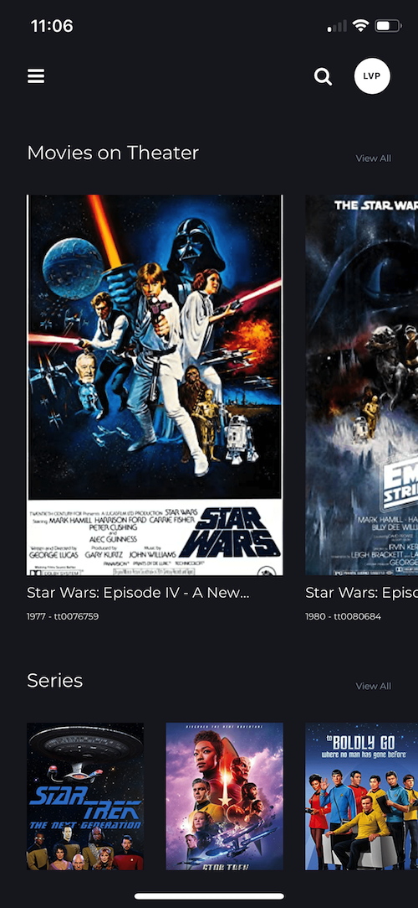
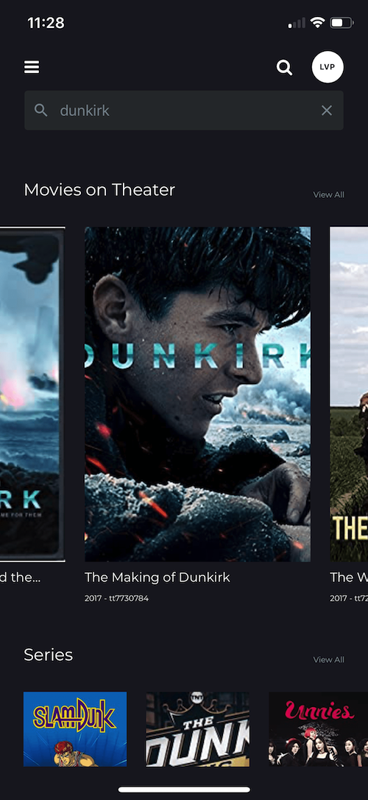

# OMDB Movies

Mobile app for searching OMDB movies.

### Table of Contents:

- [OMDB movies](#markdown-header-cimb-clicks) - [Table of Contents:](#markdown-header-table-of-contents)
  - [USEFUL LINKS](#markdown-header-useful-links)
  - [GETTING STARTED WITH DEVELOPMENT](#markdown-header-getting-started-with-development)
  - [TECHNICAL SOLUTIONS](#markdown-header-technical-solutions)
  - [FOLDER STRUCTURE](#markdown-header-folder-structure)

## Screenshots

## Approaches

1. Register new Expo account
   - to make a new Expo created react native application, we need a fresh account.
   - to make the debug process, share process, deployment process easier

## USEFUL LINKS

- Application Download: https://expo.io/@alephtimwu/movie-app
- Design: https://www.figma.com/file/pbwq3PjnyzgXdMcqJhf2n7/SC_Video_Challenge?node-id=0%3A1
- React Native: https://reactnative.dev/
- Install Expo to view: https://expo.io/
- Emotion Styled: https://emotion.sh/docs/styled
- React Native Elements: https://react-native-elements.github.io/react-native-elements/
- React Navigation: https://reactnavigation.org/
- State Management: https://github.com/diegohaz/constate
- Request Lib: https://github.com/axios/axios
- API: http://www.omdbapi.com/
- Testing Suit: https://www.native-testing-library.com/
- Jest: https://jestjs.io/en/

## GETTING STARTED WITH DEVELOPMENT

There's is a submodule in this project, **messenger**. Please sync that submodule before start building. Command to use: `git submodule update --init`

1. Installation:

   - make sure nodejs 12+ is pre-installed
   - download and execute `yarn` in root directory

2. Setting up IDE/Editor

   - we suggest to use vscode https://code.visualstudio.com/

3. Testing app in web browser

   - Execute `yarn start` to open up development console in browser (Google Chrome Prefered)
   - Select `run in web browser`

4. Unit Test:

   - Execute `yarn test` to execute unit test
   - Execute `yarn open:coverage` to view the test report

5. Publish
   - In development console, choose `publish or republish..` option and login with an expo account to publish the app.
   - Execute `expo build:android` to publish the application to android market.
   - Execute `expo build:android` to publish the application to android market.

## TECHNICAL SOLUTIONS

- [Expo][] 36 for the react native app architecture
- Emotion styled components
- Constate as light-weight state management
- React Navigation as router, with custom theme
- Jest + React Native Testing Library for unit-test
  - iPhone 7, 8, X

### DEVELOPMENT DEPENDENCIES

- [NodeJS][]
- [Yarn][]
- See _devDependencies_ in `package.json`

## FOLDER STRUCTURE

    /                           : project / git root
    +-- assets                  : folder for development assets like images, fonts
        +-- fonts                   : all the extenal fonts
    +-- components              : all public shared components
    +-- screens                 : all screens of the application
    +-- constants               : global shared constant, settings
    +-- coverage                : unit-test coverage
    +-- store                   : global shared state for application
    +-- api                     : global shared API calls

### Recommended vscode plugins:

- React Native
- Prettier
- vscode-styled-jsx
- TypeScript

### Folder and file name:

- Use upper CamelCase (camel caps) for all Component and Screen names
- Use lower kebab-case for all file names except
  - PascalCase for Class and Singleton JavaScript files
  - PascalCase for single-class-exporting TypeScript/ES6 module files
